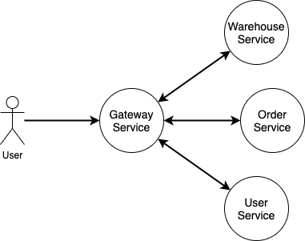

Предположим, у нас сервисы `UserService`, `OrderService`, `WarehouseService` и `Gateway`:

* На `Gateway` от пользователя `Alex` приходит запрос `Купить товар с productName: 'Lego Technic 42129`.
* `Gateway` -> `UserService` проверяем что пользователь существует и получаем `userUid` пользователя по `login: Alex`.
* `Gateway` -> `WarehouseService` получаем `itemUid` товара по `productName` и резервируем его для заказа.
* `Gateway` -> `OrderService` с `userUid` и `itemUid` и создаем заказ с `orderUid`.
* `Gateway` -> `WarehouseService` с `orderUid` и переводим товар `itemUid` из статуса `Зарезервировано` в
  статус `Заказан` и прописываем ссылку на `orderUid`.